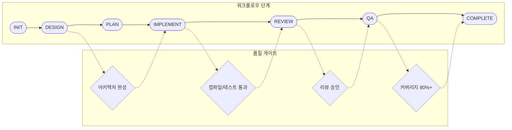
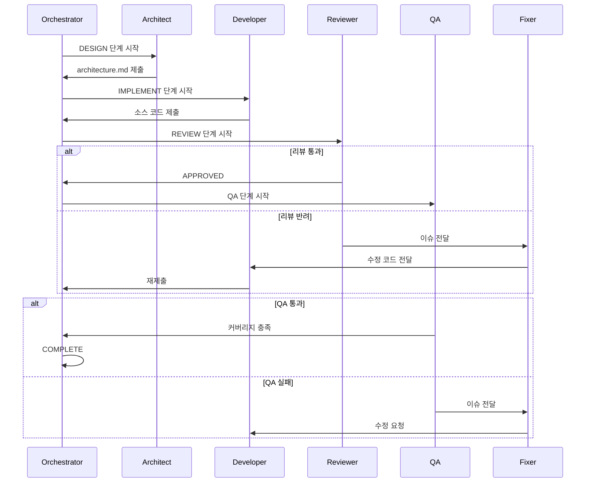

# Oracle Insert Performance Benchmark

JDBC와 MyBatis의 Insert 성능을 비교하는 벤치마크 프로젝트입니다.

## 프로젝트 목적

대용량 데이터 처리 시 최적의 Insert 방식을 선정하기 위해 다음 4가지 방식의 성능을 측정하고 비교합니다:

| 방식 | 설명 |
|------|------|
| JDBC Batch Insert | PreparedStatement + addBatch/executeBatch |
| JDBC Single Insert | PreparedStatement + executeUpdate (개별 호출) |
| MyBatis Batch Insert | ExecutorType.BATCH + flushStatements |
| MyBatis Single Insert | Mapper insert 메서드 개별 호출 |

### 측정 항목
- 총 소요시간 (ms)
- TPS (Transactions Per Second)
- 배치당/개별 insert 평균 시간
- 통계값 (평균, 표준편차, min, max)

---

## 기술 스택

| 구분 | 기술 | 버전 |
|------|------|------|
| Language | Java | 1.8 |
| Framework | Spring Boot | 2.7.18 |
| Build | Maven | 3.8+ |
| Database | Oracle | 19c |
| ORM | MyBatis | 2.3.2 |
| Test | JUnit 5, H2 | - |
| Coverage | JaCoCo | 80%+ |

---

## 빠른 시작

### 사전 요구사항

- Java 1.8+
- Maven 3.8+
- Oracle 19c (또는 호환 DB)
- jq (워크플로우용)

### 환경 변수 설정

프로젝트 루트에 `.env` 파일을 생성하고 DB 접속 정보를 설정합니다:

```bash
# .env
DB_USER=system
DB_PASSWORD=oracle
DB_SERVICE=ORCL
DB_HOST=192.168.3.13
DB_PORT=1521
```

추가 설정이 필요한 경우:

```bash
export BATCH_SIZE=1000
export RECORD_COUNT=100000
```

### 빌드 및 실행

```bash
# 빌드
mvn clean package

# 테스트
mvn test

# 커버리지 리포트
mvn jacoco:report
# 결과: target/site/jacoco/index.html

# 벤치마크 실행
mvn spring-boot:run
```

### Docker 실행

Docker를 사용하여 컨테이너 환경에서 벤치마크를 실행할 수 있습니다:

```bash
# Docker Compose로 실행
source ./.env && docker compose up --build

# 백그라운드 실행
docker compose up -d --build

# 종료
docker compose down
```

환경 변수는 `.env` 파일 또는 명령줄에서 오버라이드 가능:

```bash
RECORD_COUNT=10000 docker compose up
```

---

## 프로젝트 구조

```
java-oracle-benchmark/
├── pom.xml                     # Maven 빌드 설정
├── Dockerfile                  # Docker 이미지 빌드
├── docker-compose.yml          # Docker Compose 설정
├── .dockerignore               # Docker 빌드 제외
├── .env                        # 환경 변수 (DB 접속 정보)
├── PRD.txt                     # 요구사항 정의서
├── CLAUDE.md                   # AI 개발 지침
├── .agents/                    # Multi-Agent 역할 정의
├── .workflow/                  # 워크플로우 상태 관리
├── scripts/                    # 워크플로우 스크립트
└── src/
    ├── main/
    │   ├── java/com/example/benchmark/
    │   │   ├── BenchmarkApplication.java
    │   │   ├── config/
    │   │   │   ├── DataSourceConfig.java
    │   │   │   ├── MyBatisConfig.java
    │   │   │   └── BenchmarkProperties.java
    │   │   ├── domain/
    │   │   │   └── TestRecord.java
    │   │   ├── exception/
    │   │   │   └── BenchmarkException.java
    │   │   ├── repository/
    │   │   │   ├── BatchInsertRepository.java
    │   │   │   ├── SingleInsertRepository.java
    │   │   │   ├── JdbcBatchInsertRepository.java
    │   │   │   ├── JdbcSingleInsertRepository.java
    │   │   │   ├── MyBatisBatchInsertRepository.java
    │   │   │   └── MyBatisSingleInsertRepository.java
    │   │   ├── mapper/
    │   │   │   └── TestRecordMapper.java
    │   │   ├── benchmark/
    │   │   │   ├── BenchmarkRunner.java
    │   │   │   ├── BenchmarkResult.java
    │   │   │   └── BenchmarkReportGenerator.java
    │   │   └── util/
    │   │       ├── TestDataGenerator.java
    │   │       └── StringUtils.java
    │   └── resources/
    │       ├── application.yml
    │       ├── schema.sql
    │       └── mapper/
    │           └── TestRecordMapper.xml
    └── test/
        ├── java/com/example/benchmark/
        │   ├── BenchmarkIntegrationTest.java
        │   ├── domain/TestRecordTest.java
        │   ├── exception/BenchmarkExceptionTest.java
        │   ├── benchmark/
        │   │   ├── BenchmarkRunnerTest.java
        │   │   ├── BenchmarkResultTest.java
        │   │   └── BenchmarkReportGeneratorTest.java
        │   ├── repository/
        │   │   ├── JdbcBatchInsertRepositoryTest.java
        │   │   ├── JdbcSingleInsertRepositoryTest.java
        │   │   ├── MyBatisBatchInsertRepositoryTest.java
        │   │   └── MyBatisSingleInsertRepositoryTest.java
        │   └── util/TestDataGeneratorTest.java
        └── resources/
            ├── application.yml
            ├── application-test.yml
            └── schema-h2.sql
```

---

## 데이터 모델

### TestRecord 테이블

| 컬럼 | 타입 | 설명 |
|------|------|------|
| id | NUMBER(19) | PK, 시퀀스 |
| data1 | VARCHAR2(100) | NOT NULL |
| data2 | VARCHAR2(200) | Nullable |
| amount | NUMBER(18,2) | 금액 |
| status | VARCHAR2(20) | 상태 (기본: ACTIVE) |
| created_at | TIMESTAMP | 생성 시각 |

### DDL

```sql
CREATE TABLE test_record (
    id NUMBER(19) PRIMARY KEY,
    data1 VARCHAR2(100) NOT NULL,
    data2 VARCHAR2(200),
    amount NUMBER(18,2),
    status VARCHAR2(20) DEFAULT 'ACTIVE',
    created_at TIMESTAMP NOT NULL
);

CREATE SEQUENCE test_record_seq START WITH 1 INCREMENT BY 1;
```

---

## 벤치마크 결과

벤치마크 실행 후 결과물:
- 콘솔 출력: 실시간 진행 상황 및 요약
- CSV 파일: `benchmark-results/` 디렉토리에 저장

### 출력 예시

```
====================================================================================================
BENCHMARK RESULTS SUMMARY
====================================================================================================

| Repository Type      |      Records |  BatchSize | Iterations |      Avg TPS |  Std Dev(ms) |      Min(ms) |      Max(ms) |
------------------------------------------------------------------------------------------------------------------------
| JDBC-Batch           |      100,000 |       1000 |          3 |      7284.21 |       563.89 |        13085 |        14137 |
| MyBatis-Batch        |      100,000 |       1000 |          3 |      4735.89 |       275.38 |        20804 |        21327 |
| MyBatis-Single       |        1,000 |          1 |          3 |       770.42 |        54.29 |         1236 |         1337 |
| JDBC-Single          |        1,000 |          1 |          3 |      1239.67 |        17.90 |          786 |          817 |
------------------------------------------------------------------------------------------------------------------------

DETAILED RESULTS:
------------------------------------------------------------

[JDBC-Batch]
  Records: 100000, BatchSize: 1000, Iterations: 3
  Durations: [13085, 14137, 13963] ms
  Average Duration: 13728.33 ms
  Average TPS: 7284.21
  Std Deviation: 563.89 ms
  Min/Max: 13085 / 14137 ms

[MyBatis-Batch]
  Records: 100000, BatchSize: 1000, Iterations: 3
  Durations: [21215, 21327, 20804] ms
  Average Duration: 21115.33 ms
  Average TPS: 4735.89
  Std Deviation: 275.38 ms
  Min/Max: 20804 / 21327 ms

[MyBatis-Single]
  Records: 1000, BatchSize: 1, Iterations: 3
  Durations: [1337, 1321, 1236] ms
  Average Duration: 1298.00 ms
  Average TPS: 770.42
  Std Deviation: 54.29 ms
  Min/Max: 1236 / 1337 ms

[JDBC-Single]
  Records: 1000, BatchSize: 1, Iterations: 3
  Durations: [817, 817, 786] ms
  Average Duration: 806.67 ms
  Average TPS: 1239.67
  Std Deviation: 17.90 ms
  Min/Max: 786 / 817 ms

PERFORMANCE COMPARISON:
------------------------------------------------------------
Fastest: JDBC-Batch with 7284.21 TPS

  vs MyBatis-Batch: 1.54x faster
  vs MyBatis-Single: 9.45x faster
  vs JDBC-Single: 5.88x faster

CSV report saved to: /app/benchmark-results/benchmark_result_20251201_074726.csv
============================================================
Benchmark completed
============================================================
```

---

## Multi-Agent 개발 워크플로우

이 프로젝트는 AI Agent 기반의 자동화된 개발 워크플로우를 지원합니다.

### 워크플로우 개요



### Agent 상호작용



### Agent 역할

| Agent | 역할 | 산출물 |
|-------|------|--------|
| Orchestrator | 전체 워크플로우 제어 | implementation-plan.md |
| Architect | 기술 설계 및 구조 결정 | architecture.md |
| Developer | 코드 구현 | 소스 코드 |
| Reviewer | 코드 품질 검토 | review-report.md |
| QA | 테스트 및 커버리지 검증 | qa-report.md |
| Fixer | 리뷰/QA 이슈 수정 | 수정된 코드 |

### 워크플로우 단계

```
INIT → DESIGN → PLAN → IMPLEMENT → REVIEW → QA → COMPLETE
```

### 품질 게이트

| 전환 | 필수 조건 |
|------|----------|
| DESIGN → IMPLEMENT | 아키텍처 문서 완성 |
| IMPLEMENT → REVIEW | 컴파일 통과, 기본 테스트 통과 |
| REVIEW → QA | 리뷰 APPROVED |
| QA → COMPLETE | 커버리지 80%+, 전체 테스트 통과 |

### 워크플로우 명령어

```bash
# 스크립트 실행 권한 부여
chmod +x scripts/*.sh

# 워크플로우 시작
./scripts/workflow.sh start

# 상태 확인
./scripts/workflow.sh status

# 중단 후 재개
./scripts/workflow.sh resume

# 처음부터 다시 시작
./scripts/workflow.sh new

# 병렬 실행 (Git Worktrees)
./scripts/workflow.sh parallel init
./scripts/workflow.sh parallel start
```

---

## 설정

### application.yml

```yaml
spring:
  datasource:
    url: jdbc:oracle:thin:@${DB_HOST:localhost}:${DB_PORT:1521}/${DB_SERVICE:xe}
    username: ${DB_USER:benchmark}
    password: ${DB_PASSWORD:benchmark}

benchmark:
  batch-size: ${BATCH_SIZE:1000}
  record-count: ${RECORD_COUNT:100000}
  iterations: ${ITERATIONS:3}
  warmup-count: ${WARMUP_COUNT:1000}
```

> `.env` 파일의 환경 변수가 자동으로 적용됩니다.

---

## 트러블슈팅

### 워크플로우가 멈춘 경우

```bash
./scripts/workflow.sh status   # 상태 확인
./scripts/workflow.sh reset    # 상태 초기화
./scripts/workflow.sh new      # 새로 시작
```

### 컴파일/테스트 에러

1. `.workflow/artifacts/` 산출물 확인
2. 수동으로 코드 수정
3. `./scripts/workflow.sh resume`로 재개

### Oracle 연결 문제

- JDBC URL 형식 확인: `jdbc:oracle:thin:@host:port:sid`
- 환경 변수가 올바르게 설정되었는지 확인
- Oracle Listener 상태 확인

---

## 라이센스

MIT License
